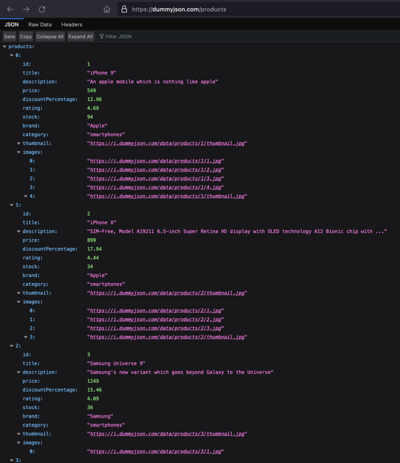
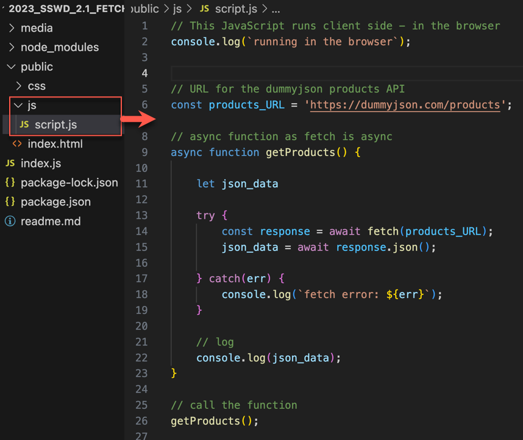
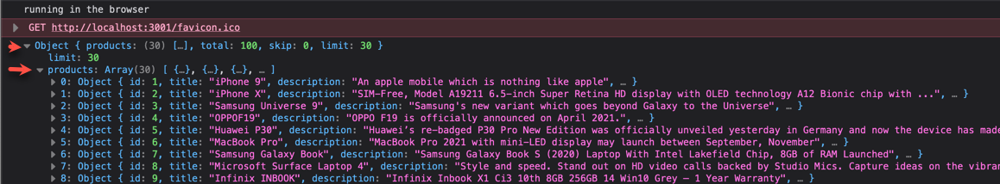
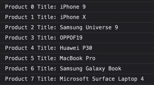

# Lab 2: Using the JavaScript Fetch API

## Introduction

In this lab you will use the JavaScript Fetch API to request data from a web service and display it in a page.

The Fetch API provides an interface for fetching resources (including across the network). Underneath it uses XMLHttpRequest to retrieve data using AJAX requests.

The example will use JavaScript Async/ Await make an asynchronous request to get data from the web service and then await a response. This is to help deal with unpredictability associated with accessing third party services due to server load and/ or network conditions. 

 

## 1. Getting data from a web service API

In this example we will use the [DummyJSON](https://dummyjson.com) service for testing. 

* A standard HTTP request is used to `GET` data.
* Data is returned as `JSON` (**J**ava**S**cript **O**bject **N**otation).

See the [DummyJSON Docs](https://dummyjson.com/docs) and the available [Resources](https://github.com/Ovi/DummyJSON) for examples of how to use the service.  For example to retrieve 100 products open: https://dummyjson.com/products/ 

You should see a web page filled with `JSON` repesenting a list of products. [Firefox](https://www.mozilla.org/en-GB/firefox/) has a built in `JSON` viewer which makes it easier to read.



## 2. Retrieving the product data with JavaScript

The above example retrieves product data directly via the web browser, next we will use JavaScript and the `Fetch API` to script the request.

The example will build on the finished example from **Lab 1** whiich hosted a static website. The example is included in this repository, download it and open in VS Code.

To run the example, open a VS code terminal, then:

```bash
npm install
npm run start
```


1. Open `script.js` in the `public/js` folder. Remember this JavaScript executes in the browser when the public site is loaded.

   Add the code below, which uses `fetch` to `GET` JSON data from the `products_URL` .

   * `products_URL` defines the `URI` of API endpoint.

   * The `getProducts()` functions is defined as `async`. This is because `fetch` operates `asyncronously`. This is to avoid blocking in case the requests takes longer than expected (unpredictable when accessing network resources).

   * The `try/ catch` block is used to gracefully deal with any exceptions which may occur during the Fetch call.

   * After data is retrieved it is logged to the **browser** console.

   * Note the use of `const` and `let` for variable declarations.

     




2. Test the script by serving the website using `npm run start` and view the results in the browser console. 

   * Notice that a JSON `Object` was received which contains an array named `products`. The array contains the individual `products` indexed 0 to 100.

   

3. Display the `products` array without its container object.

   ```javascript
   // display products contained in the json data
   console.log(json_data.products);
   ```

4. Display the first product.

   ```javascript
   // display the first product contained in products array
   console.log(json_data.products[0]);
   ```

5. Display the last product.

   ```javascript
   // get the last products array object
   const products = json_data.products;
   console.log(products[products.length - 1]);
   ```

6. Display the title of the first product.

   ```javascript
   // display the title of the first product
   const products = json_data.products;
   console.log(products[0].title);
   ```

   

## 3. Exercises

1. Display the titles of each product in the console, following this example:



2. Display `id` , `title`, and `description` for each product, in the console.

3. Display `id` , `title`, and `description` for each product, in `index.html`.

------

Enda Lee 2023